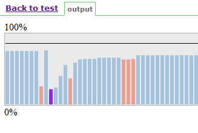

Ratchet
=======

Ratchet,  your Generic customizable Jenkins Ratcheting solution.

Configuration:

    After the plugin is installed, go to Manage Jenkins-> Configure System.
    Locate the Ratchet section and specify the database filepath. This is where the SQLite database that contains result/threshold data will be stored.

        The default location we use:
        Icon

        D:\Jenkins\Ratchet.db
    Next configure the job you want to add Ratcheting to. click the Add build step button, and select Ratcheting.
    Fill out the required information
        File - Insert the filename of the output file generated by your job.
        Regex - This is the regex used to locate the result in your output file.
        override - This is used for overriding the current Threshold.
        Report File - This is the name of the file that will be generated by the Ratchet plugin. to display historical data.
        Example:
    You will probably also want to create a Post-build Action that Publishes the HTML Report.

Usage

    Failures
        When the Threshold fails to be met, the Ratchet plugin will cause the job to fail. It will display the current result against the threshold.
	
    Reports
        The Ratchet report will display a bar graph showing the percentage of the different builds.
        Hovering over the bars will display the build number, and the values that were ratcheted on. 
        Clicking on one of the bars will load the console log for that particular job in the lower portion of the page.
	
            Blue bars indicate passed jobs
            Red bars indicate failed jobs
            Purple bars indicate a job where the Threshold was overridden. 
